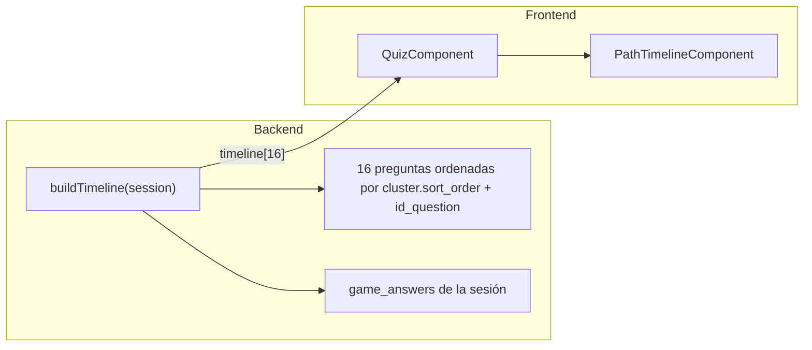

# Plan: camino global de 16 indicadores en el quiz

## Objetivo

Mostrar en la columna izquierda del quiz **todos los círculos de progreso del juego** (16), independientemente del cluster activo. Cada círculo refleja el estado de su pregunta:

- `current` — pregunta en curso (azul)
- `correct` — respondida correctamente (verde)
- `incorrect` — respondida incorrectamente (rojo)
- `pending` — sin responder (gris/atenuado)

Sin separadores visuales entre clusters: **16 círculos seguidos**.



## Estado actual

- [`euro-api/app/Services/GameService.php`](../euro-api/app/Services/GameService.php) — `buildTimeline()` filtra solo por `current_cluster_id` → devuelve **4** ítems.
- [`frontend/src/app/features/quiz/path-timeline/`](../frontend/src/app/features/quiz/path-timeline/) — ya renderiza un círculo por cada `TimelineItem`; **no necesita cambio de lógica**, solo CSS.
- [`frontend/src/app/core/models/game.models.ts`](../frontend/src/app/core/models/game.models.ts) — `TimelineItem` (`question_id`, `status`) **sigue siendo válido**; no hace falta ampliar el contrato API.

## Cambios propuestos

### 1. Backend — ampliar `buildTimeline()` (cambio principal)

**Archivo:** [`euro-api/app/Services/GameService.php`](../euro-api/app/Services/GameService.php)

Reemplazar la consulta acotada al cluster actual por **todas las preguntas del juego**, ordenadas globalmente:

1. `JOIN` con `clusters`
2. `ORDER BY clusters.sort_order ASC, questions.id_question ASC`
3. Mantener la lógica de estado existente (sin tocar):

```php
// Lógica actual a conservar tal cual
if ((int) $session->current_question_id === (int) $q->id_question && ! $answer) {
    $status = 'current';
} elseif ($answer) {
    $status = $answer->is_correct ? 'correct' : 'incorrect';
} else {
    $status = 'pending';
}
```

**Comportamiento esperado por escenario:**

| Momento | Resultado en timeline |
|---------|----------------------|
| Inicio cluster 1, pregunta 1 | 1 `current`, 15 `pending` |
| Tras responder pregunta 3 del cluster 1 | 3 `correct`/`incorrect`, 1 `current`, 12 `pending` |
| Cluster 1 completado (entre pantallas) | 4 con estado final, 12 `pending`, ningún `current` |
| Inicio cluster 2 | 4 respondidas + 1 `current` + 11 `pending` |
| Última pregunta del juego | 15 con estado final + 1 `current` |

Los endpoints que ya devuelven `timeline` (`getCurrentState`, `advanceQuestion` con `next_question`) **no requieren cambios adicionales**; heredan el nuevo comportamiento automáticamente.

### 2. Frontend — ajuste CSS para 16 círculos

**Archivos:**

- [`frontend/src/app/features/quiz/quiz.scss`](../frontend/src/app/features/quiz/quiz.scss) — columna `&__timeline`
- [`frontend/src/app/features/quiz/path-timeline/path-timeline.scss`](../frontend/src/app/features/quiz/path-timeline/path-timeline.scss)

Con 16 ítems la columna puede desbordar en pantallas pequeñas. Ajustes mínimos:

- En `quiz-screen__timeline`: `overflow-y: auto` y `min-height: 0` (para que el flex permita scroll interno).
- En `.timeline`: reducir ligeramente `gap` (p. ej. de `10px` a `6px`–`8px`) para que quepa mejor en móvil sin scroll excesivo.

**No tocar:**

- `path-timeline.html` / `path-timeline.ts` — el `@for` ya itera todos los ítems.
- `quiz.ts` — ya asigna `res.timeline` al signal; funcionará con 16 elementos sin cambios.

### 3. Verificación manual

Probar el flujo completo en el navegador:

1. Iniciar cluster 1 → comprobar 16 círculos (1 azul, resto gris).
2. Responder 2 preguntas → 2 coloreadas + 1 azul + resto gris.
3. Completar cluster 1 → resumen → iniciar cluster 2 → primeros 4 con estado final, 5.º azul.
4. Pausar y reanudar → timeline conserva estados.
5. Comprobar en viewport móvil que la columna izquierda no rompe el layout (scroll si hace falta).

No hay tests automatizados de timeline en el repo; con este alcance basta la verificación manual.

## Alcance explícitamente excluido

- Separadores visuales entre clusters (descartado por preferencia del usuario).
- Mostrar valores numéricos de puntos en la barra lateral.
- Nuevos endpoints o cambios en `TimelineItem`.
- Cambios estéticos adicionales no relacionados con el timeline.

## Riesgo y mitigación

| Riesgo | Mitigación |
|--------|------------|
| Orden incorrecto de preguntas | Ordenar por `clusters.sort_order`, no por `cluster_id` numérico |
| Columna demasiado alta en móvil | `overflow-y: auto` + gap reducido |
| Regresión en estados `current`/`correct` | Reutilizar la misma lógica de estado; solo ampliar el conjunto de preguntas |

## Estimación de diff

- **1 método** en PHP (`buildTimeline`)
- **2 archivos SCSS** con ajustes menores
- **0 métodos nuevos** en frontend ni backend

## Tareas

- [x] Modificar `buildTimeline()` en `GameService.php` para devolver las 16 preguntas ordenadas globalmente con la lógica de estado actual
- [x] Ajustar `quiz.scss` y `path-timeline.scss` para acomodar 16 círculos (gap reducido, scroll en columna izquierda)
- [ ] Verificar manualmente el timeline en cluster 1, transición a cluster 2, pausa/reanudación y viewport móvil
