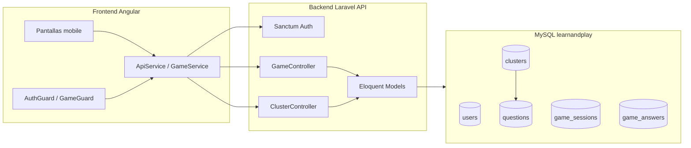
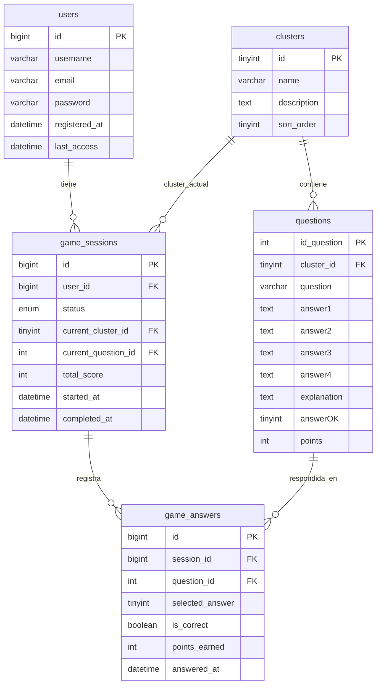
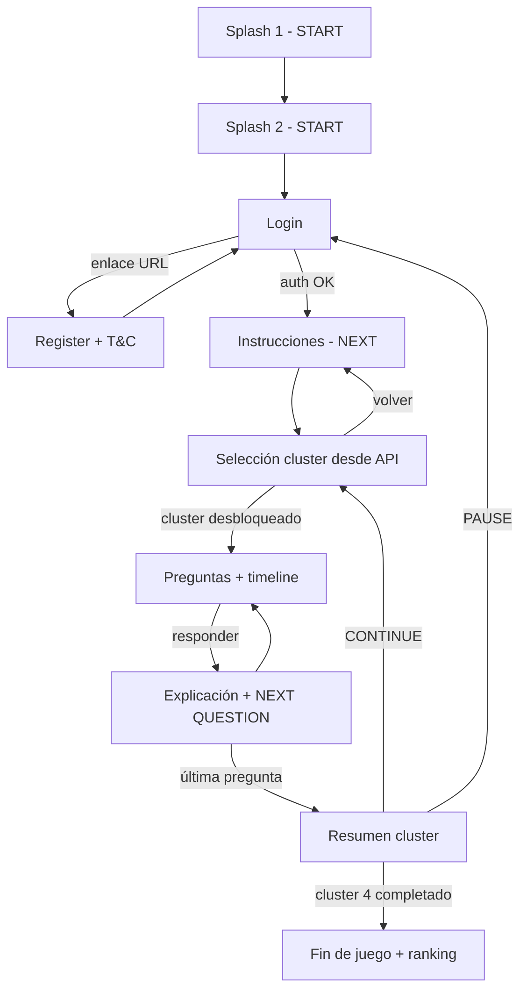

# Plan: Euro Learn & Play

## Contexto

Proyecto **greenfield**: carpetas [`backend/`](../backend/) y [`frontend/`](../frontend/) vacías. Especificación en [`SRC/Prompt-dani.pdf`](../SRC/Prompt-dani.pdf) y [`prompts/prompt-inicial.md`](../prompts/prompt-inicial.md). Credenciales MySQL en [`.env`](../.env) (raíz del repo, formato custom).

**Stack acordado:** Angular (SPA mobile-first) + Laravel API (PHP 8.3).

**Alcance inicial:** solo mobile. Tablet en standby (media queries CSS más adelante).

---

## Arquitectura general



**Comunicación:** JSON REST. Autenticación con **Laravel Sanctum** (tokens para SPA). CORS configurado para el dev server de Angular.

**Entorno:** Mapear variables de [`.env`](../.env) raíz a `backend/.env` de Laravel:

| Variable raíz | Laravel |
|---------------|---------|
| DB_HOST | DB_HOST |
| DB_USER | DB_USERNAME |
| DB_PASSWD | DB_PASSWORD |
| DB_NAME | DB_DATABASE |
| DB_CHARSET | DB charset utf8mb4 |
| DB_COLLATION | collation utf8mb4_unicode_ci |

Revisar `DB_PREFIX_PAT` — si no aplica, tablas sin prefijo (`users`, `clusters`, `questions`, etc.).

---

## Modelo de datos

### Diagrama relacional



### Tabla `users`

| Campo | Tipo | Notas |
|-------|------|-------|
| id | BIGINT UNSIGNED AI | PK |
| username | VARCHAR(64) UNIQUE | |
| email | VARCHAR(255) UNIQUE | |
| password | VARCHAR(255) | bcrypt |
| registered_at | DATETIME | fecha de registro |
| last_access | DATETIME | actualizar en cada login |

### Tabla `clusters`

Catálogo de categorías del juego. Centraliza nombre y descripción que el PDF pide mostrar en la pantalla de selección.

| Campo | Tipo | Notas |
|-------|------|-------|
| id | TINYINT UNSIGNED AI | PK (1-4 en seed) |
| name | VARCHAR(128) | título del botón, ej. "Cluster 1 — History of the Euro" |
| description | TEXT | descripción corta bajo el título |
| sort_order | TINYINT UNSIGNED UNIQUE | orden secuencial 1→2→3→4 |

**Por qué tabla propia y no hardcode:**
- El PDF exige descripción por cluster editable sin redeploy.
- `questions` y `game_sessions` referencian el cluster por FK, no por número mágico.
- Facilita ampliar campos futuros (icono, color, activo/inactivo).

### Tabla `questions`

| Campo | Tipo | Notas |
|-------|------|-------|
| id_question | INT UNSIGNED AI | PK (nombre según PDF) |
| cluster_id | TINYINT UNSIGNED FK → clusters.id | ON DELETE RESTRICT |
| question | VARCHAR(512) | |
| answer1..answer4 | TEXT | nullable si hay menos de 4 opciones |
| explanation | TEXT | feedback tras responder |
| answerOK | TINYINT UNSIGNED | índice 1-4 de respuesta correcta |
| points | INT UNSIGNED | puntos si acierta; KO = 0 |

Índice compuesto `(cluster_id, id_question)` para orden de lectura.

### Tabla `game_sessions`

Un usuario solo puede tener **una sesión activa** (`in_progress` o `paused`).

| Campo | Tipo | Notas |
|-------|------|-------|
| id | BIGINT UNSIGNED AI | PK |
| user_id | BIGINT FK → users.id | UNIQUE si status != completed |
| status | ENUM | in_progress, paused, completed |
| current_cluster_id | TINYINT FK → clusters.id | cluster en curso |
| current_question_id | INT FK → questions.id | nullable al terminar cluster/juego |
| total_score | INT UNSIGNED DEFAULT 0 | acumulado global |
| started_at | DATETIME | |
| completed_at | DATETIME | nullable |

### Tabla `game_answers`

Historial de respuestas y datos para el **camino lateral** (timeline).

| Campo | Tipo | Notas |
|-------|------|-------|
| id | BIGINT UNSIGNED AI | PK |
| session_id | BIGINT FK → game_sessions.id | |
| question_id | INT FK → questions.id | |
| selected_answer | TINYINT | 1-4 |
| is_correct | BOOLEAN | OK / KO |
| points_earned | INT | 0 si KO |
| answered_at | DATETIME | |

### Relaciones Eloquent

```php
// Cluster hasMany Question, hasMany GameSession
// Question belongsTo Cluster, hasMany GameAnswer
// GameSession belongsTo User, belongsTo Cluster, belongsTo Question, hasMany GameAnswer
// GameAnswer belongsTo GameSession, belongsTo Question
// User hasMany GameSession
```

---

## Reglas de negocio

### Juego y sesión
- Una vez iniciado el juego, **no se puede reiniciar** hasta completar los 4 clusters.
- Botón **PAUSE** → `status = paused`; al volver a entrar, reanudar en cluster/pregunta exactos.
- Al completar el juego entero y empezar de nuevo → **borrar** `game_sessions` + `game_answers` del usuario y crear sesión nueva.
- Ranking final: posición según `total_score` entre sesiones `completed`.

### Clusters
- Progresión **secuencial** según `sort_order`: cluster N+1 desbloqueado solo tras completar cluster N.
- Pantalla de selección: botón por cluster con `name` + `description` desde API; clusters bloqueados deshabilitados visualmente.
- Resumen de cluster: texto dinámico según cluster completado ("first cluster", "second cluster", etc.).
- Último cluster (sort_order = 4): pantalla resumen sustituida por **Fin de juego** (sin PAUSE/CONTINUE de cluster).

### Preguntas
- Máximo 4 respuestas; solo 1 correcta.
- Orden: `id_question ASC` dentro del cluster (PDF).
- Tras responder: mostrar explicación + botón "NEXT QUESTION" (última del cluster: "CONTINUE").
- No enviar `answerOK` al cliente hasta **después** de la respuesta.

---

## Flujo de pantallas (Angular)



**Rutas Angular propuestas:**

| Ruta | Pantalla |
|------|----------|
| `/` | Splash 1 |
| `/splash-2` | Splash 2 |
| `/login` | Login |
| `/register` | Register |
| `/instructions` | Instrucciones |
| `/clusters` | Selección cluster |
| `/quiz/:clusterId` | Preguntas |
| `/summary/:clusterId` | Resumen cluster |
| `/game-over` | Fin de juego |

**Guards:**
- `AuthGuard`: rutas post-login.
- `GameGuard`: redirige según estado de sesión (pausada, en curso, completada).

**Componentes clave:**
- `PathTimelineComponent`: columna izquierda, puntos verticales (azul actual, azul atenuado pendiente, verde OK, rojo KO).
- `ClusterCardComponent`: botón con `name` + `description` + estado (locked / active / completed).
- Header fijo: logo + username + puntos acumulados.

Mockups del PDF (págs. 1-9) guiarán CSS; placeholders hasta recibir assets finales.

---

## API REST (Laravel)

| Método | Ruta | Descripción |
|--------|------|-------------|
| POST | `/api/register` | username, email, password, accept_terms |
| POST | `/api/login` | username_or_email, password → token Sanctum |
| POST | `/api/logout` | invalidar token |
| GET | `/api/me` | usuario + resumen sesión de juego |
| GET | `/api/clusters` | clusters con progreso del usuario |
| POST | `/api/game/start` | `{ cluster_id }` — inicia sesión en cluster indicado |
| GET | `/api/game/current` | pregunta actual, timeline, puntuación |
| POST | `/api/game/answer` | `{ question_id, selected_answer }` → OK/KO + explanation |
| POST | `/api/game/pause` | pausar sesión |
| POST | `/api/game/restart` | solo si `completed`; borra historial |
| GET | `/api/game/ranking` | posición del usuario y ranking |

**Ejemplo respuesta `GET /api/clusters`:**

```json
{
  "clusters": [
    {
      "id": 1,
      "name": "Cluster 1 — History of the Euro",
      "description": "Learn about the origins of the euro currency.",
      "sort_order": 1,
      "status": "completed",
      "score": 800
    },
    {
      "id": 2,
      "name": "Cluster 2 — European Central Bank",
      "description": "Discover the role of the ECB.",
      "sort_order": 2,
      "status": "available",
      "score": null
    }
  ]
}
```

Valores de `status` por cluster: `locked`, `available`, `in_progress`, `completed`.

---

## Seed de desarrollo

1. **ClusterSeeder** (ejecutar primero): 4 filas con `name`, `description`, `sort_order` 1-4.
2. **QuestionSeeder**: 4 preguntas por `cluster_id` (16 total), contenido ficticio euro/BCE, `points` 100-500.
3. Instrucciones: texto placeholder en componente Angular (tabla de config opcional en fase posterior).

---

## Estructura de carpetas

```
backend/
  app/Models/{User,Cluster,Question,GameSession,GameAnswer}.php
  app/Http/Controllers/Api/{AuthController,ClusterController,GameController}.php
  app/Http/Resources/{ClusterResource,QuestionResource,...}.php
  database/migrations/
  database/seeders/{ClusterSeeder,QuestionSeeder,DatabaseSeeder}.php
  routes/api.php
  .env                          # generado desde .env raíz

frontend/
  src/app/
    core/                       # guards, interceptors, auth/game services
    features/
      splash/
      auth/
      instructions/
      clusters/                 # ClusterCardComponent
      quiz/                     # PathTimelineComponent
      summary/
      game-over/
    shared/                     # header, botones
  src/styles/                   # mobile-first, variables CSS
```

---

## Fases de implementación

### Fase 1 — Infraestructura
- Laravel 11+ en `backend/` (API-only, Sanctum, CORS).
- Angular **21** en `frontend/` (routing, HttpClient, interceptor token).
- **Node 24** vía [`.nvmrc`](../.nvmrc) — ejecutar `nvm use` antes de npm/npx.
- Dev server Angular en puerto **4700**; CORS backend → `http://localhost:4700`.
- Migraciones: `users`, **`clusters`**, `questions`, `game_sessions`, `game_answers`.
- Seeders: ClusterSeeder + QuestionSeeder.
- Verificar conexión MySQL con [`.env`](../.env).

### Fase 2 — Auth + Splash
- Endpoints register / login / logout / me.
- Pantallas Splash 1, Splash 2, Login, Register (mobile).
- Enlace login ↔ register por ruta (`/register`).

### Fase 3 — Flujo de juego
- GET `/api/clusters` + pantalla selección con name/description desde BD.
- Instrucciones → quiz → feedback → resumen cluster.
- Timeline lateral y header con puntuación.

### Fase 4 — Reglas y persistencia
- Pausa / reanudación al login.
- Bloqueo reinicio mid-game.
- Fin de juego + ranking.
- Reinicio post-completado (borrado historial).

### Fase 5 — Pulido mobile
- CSS según mockups PDF.
- Loading, errores de red, estados vacíos.
- Hooks `@media (min-width: 768px)` para tablet (sin layout tablet aún).

---

## Decisiones técnicas

| Tema | Decisión |
|------|----------|
| Backend | Laravel completo + Sanctum (PHP 8.3) |
| Frontend | Angular 21 standalone components |
| Node.js | v24 vía `.nvmrc` en raíz + `nvm use` antes de npm/npx |
| Dev server | Angular en puerto **4700** (`http://localhost:4700`) |
| Catálogo clusters | Tabla `clusters` con FK en `questions` y `game_sessions` |
| Estilos | CSS/SCSS mobile-first |
| Idioma UI | Inglés (NEXT, CONTINUE, PAUSE, etc.) |
| Progresión | Secuencial por `sort_order`; API indica locked/available |

---

## Pendiente de confirmar en implementación

1. **Assets visuales** del PDF (logo, colores).
2. **URL Terms & Conditions** para checkbox de registro.
3. **Prefijo `DB_PREFIX_PAT`:** usar o ignorar en este proyecto.
4. **`.env` raíz vs `backend/.env`:** sincronizar; commitear solo `.env-example`.

---

## Tareas de implementación

- [x] Inicializar Laravel API en `backend/` con Sanctum, CORS y `.env` desde credenciales raíz
- [x] Inicializar Angular 21 en `frontend/` con routing, HttpClient e interceptor auth (Node 24, puerto 4700)
- [x] Crear migraciones `users`, `clusters`, `questions`, `game_sessions`, `game_answers` + seeders
- [x] Implementar endpoints register / login / logout / me
- [x] Pantallas Splash 1, Splash 2, Login y Register (mobile-first)
- [x] Implementar endpoints de juego: start, current, answer, pause, restart, ranking
- [x] Pantallas instrucciones, clusters, quiz con timeline, resumen cluster y fin de juego
- [x] Guards y lógica básica: pausa/reanudación, borrado historial al recomenzar
- [ ] Ajustes visuales según mockups PDF y preparación media queries tablet
