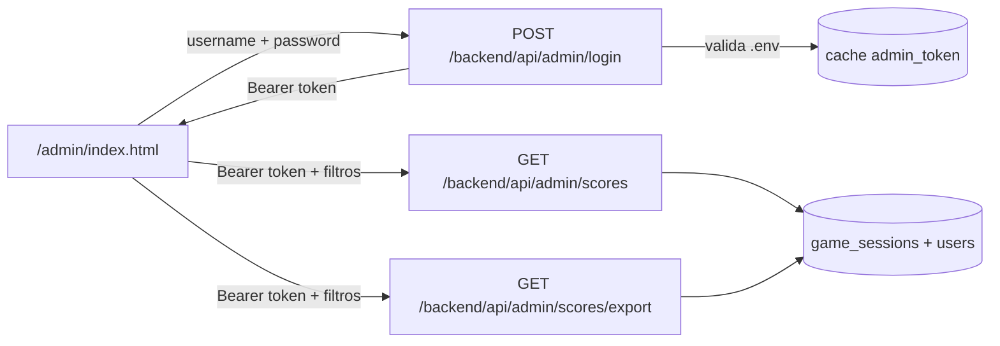

# Plan: panel admin de puntuaciones

**Estado:** revisado — pendiente de implementación.

## Objetivo

Panel de administración accesible en `/admin/` para consultar **todas las partidas completadas** (`game_sessions`), con filtrado por email y nombre de jugador, ordenación, paginación server-side y exportación a Excel. Protegido por usuario/contraseña definidos en `.env`.

---

## Alcance confirmado

- **Fuente de datos:** `game_sessions` con `status = 'completed'`, join con `users` para nombre y email.
- **Una fila = una partida** (un jugador puede repetirse).
- **Filtros:** email y username (búsqueda parcial `LIKE`).
- **Ordenación:** email, username, puntuación (`total_score`), fecha (`completed_at`).
- **Paginación:** server-side.
- **Exportación:** Excel real (`.xlsx`) con los mismos filtros/orden que el listado (sin paginar; con tope de seguridad).

---

## Enfoque elegido

| Capa | Decisión |
|------|----------|
| UI | HTML + JS plano en `frontend/public/admin/` → URL `/admin/` |
| Diseño | Bootstrap 5 vía CDN (login, tabla, filtros, paginación) |
| API | Laravel en `euro-api/` |
| Auth | `ADMIN_USERNAME` + `ADMIN_PASSWORD` en `.env`; login devuelve token Bearer temporal en cache |
| Build | Mismo `ng build` del juego; copia `public/admin/` → `www/admin/` |



---

## Backend Laravel

### 1. Dependencia Excel

Añadir **Laravel Excel** (`maatwebsite/excel`) en `euro-api/composer.json`:

```bash
composer require maatwebsite/excel
```

Genera `.xlsx` nativo vía PhpSpreadsheet.

### 2. Configuración

Nuevo archivo `euro-api/config/admin.php`:

- `username` → `env('ADMIN_USERNAME')`
- `password` → `env('ADMIN_PASSWORD')`
- `token_ttl_hours` → `env('ADMIN_TOKEN_TTL_HOURS', 8)`
- `export_max_rows` → `env('ADMIN_EXPORT_MAX_ROWS', 10000)`
- `default_per_page` → `25`

Documentar en `euro-api/.env.example`:

```
ADMIN_USERNAME=
ADMIN_PASSWORD=
ADMIN_TOKEN_TTL_HOURS=8
ADMIN_EXPORT_MAX_ROWS=10000
```

### 3. Autenticación admin (login + token)

**Login** — `euro-api/app/Http/Controllers/Api/Admin/AuthController.php`:

- `POST /api/admin/login` recibe `{ username, password }`.
- Valida contra `config('admin.username')` y `config('admin.password')` con `hash_equals()`.
- Credenciales no configuradas en `.env` → `503`.
- Credenciales incorrectas → `401`.
- Credenciales correctas → token aleatorio (`Str::random(64)`) en cache (`admin_token:{token}`) con TTL; respuesta `{ token, expires_in }`.
- Throttle: `throttle:5,1`.

**Middleware** — `euro-api/app/Http/Middleware/AdminAuthMiddleware.php`:

- Lee `Authorization: Bearer {token}`.
- Comprueba `Cache::has("admin_token:{$token}")`; si no → `401`.
- Alias `admin.auth` en `euro-api/bootstrap/app.php`.

**Logout** — `POST /api/admin/logout` (protegido): invalida el token en cache.

### 4. Controlador de puntuaciones

`euro-api/app/Http/Controllers/Api/Admin/ScoreController.php`:

**`index`** — listado paginado:

```php
GameSession::query()
    ->with('user:id,username,email,department_id')
    ->where('status', 'completed')
    ->when($email, fn ($q) => $q->whereHas('user', fn ($u) => $u->where('email', 'like', "%{$email}%")))
    ->when($username, fn ($q) => $q->whereHas('user', fn ($u) => $u->where('username', 'like', "%{$username}%")))
    ->orderBy($sortColumn, $order);
```

Parámetros validados:

| Param | Valores | Default |
|-------|---------|---------|
| `email` | string opcional | — |
| `username` | string opcional | — |
| `sort` | `email`, `username`, `total_score`, `completed_at` | `completed_at` |
| `order` | `asc`, `desc` | `desc` |
| `page` | int ≥ 1 | 1 |
| `per_page` | int 10–100 | 25 |

Para ordenar por campos de `users`, usar join o subquery con whitelist explícita.

Respuesta JSON estándar de paginación Laravel (`data`, `meta`, `links`).

**`export`** — descarga Excel:

- Mismos filtros y `sort`/`order` que `index`.
- Sin paginación; `limit(export_max_rows)`.
- Si el total filtrado supera el tope → `422`.
- Nombre archivo: `partidas-YYYY-MM-DD_HH-mm.xlsx`.

### 5. Clase de exportación

`euro-api/app/Exports/GameSessionsExport.php` — `FromQuery`, `WithHeadings`, `WithMapping`:

| Columna Excel | Origen |
|---------------|--------|
| ID partida | `game_sessions.id` |
| Jugador | `users.username` |
| Email | `users.email` |
| Departamento | `users.department_id` |
| Puntuación | `game_sessions.total_score` |
| Inicio | `game_sessions.started_at` |
| Finalizada | `game_sessions.completed_at` |

### 6. Rutas

En `euro-api/routes/api.php`:

```php
Route::prefix('admin')->group(function () {
    Route::post('/login', [AdminAuthController::class, 'login'])->middleware('throttle:5,1');

    Route::middleware('admin.auth')->group(function () {
        Route::post('/logout', [AdminAuthController::class, 'logout']);
        Route::get('/scores', [AdminScoreController::class, 'index']);
        Route::get('/scores/export', [AdminScoreController::class, 'export']);
    });
});
```

URLs en producción:

- `/backend/api/admin/login`
- `/backend/api/admin/scores`
- `/backend/api/admin/scores/export`

Reutiliza `GameSession::user()` en `euro-api/app/Models/GameSession.php`.

---

## Frontend estático (`/admin/`) con Bootstrap 5

Archivos en `frontend/public/admin/`:

| Archivo | Rol |
|---------|-----|
| `index.html` | Login + panel; Bootstrap 5 vía CDN |
| `admin-scores.js` | Login, fetch con Bearer, filtros, ordenación, paginación, export |
| `admin-scores.css` | Ajustes mínimos (opcional) |

### Componentes Bootstrap

- **Login:** `card`, `form-control`, `btn btn-primary`, `alert alert-danger`.
- **Filtros:** `row` / `col-*`, `form-control`, `btn btn-secondary`.
- **Tabla:** `table table-striped table-hover table-responsive`.
- **Paginación:** `pagination`.
- **Acciones:** `btn btn-success` (Excel), `btn btn-outline-secondary` (cerrar sesión).

Bootstrap **no** se añade al bundle Angular; solo en la página admin.

### Comportamiento UI

1. Sin token en `sessionStorage` → formulario login → `POST /api/admin/login` → guardar token (no la contraseña).
2. `401` de la API → borrar token y volver al login.
3. Filtros email y username; botón "Buscar".
4. Tabla: Jugador, Email, Puntuación, Fecha; cabeceras ordenables.
5. Paginación: Anterior / Siguiente + "Página X de Y (N partidas)".
6. Exportar Excel: `fetch` + `blob` + `Authorization: Bearer {token}`.
7. Cerrar sesión: `POST /api/admin/logout`.

`apiUrl` relativo: `/backend/api/admin/...` (mismo patrón que `frontend/src/environments/environment.prod.ts`).

---

## Despliegue en `www/admin/`

Estructura tras `npx ng build --configuration production`:

```
www/
├── index.html              ← juego Angular
├── main-xxxxx.js
├── styles-xxxxx.css
├── img/
├── backend/                ← API Laravel
└── admin/                  ← panel admin
    ├── index.html
    ├── admin-scores.js
    └── admin-scores.css
```

- Código fuente: `frontend/public/admin/`.
- Angular copia `public/**` a `www/` (`frontend/angular.json` → `outputPath: ../www`).
- **No hace falta build Vite aparte** para el admin (archivos estáticos).
- El `.htaccess` catch-all del juego **no afecta** a `/admin/` (carpeta real en el servidor).

---

## Seguridad

- Endpoints admin separados del grupo `auth:sanctum` de jugadores.
- Credenciales solo en `.env`; contraseña fuerte en producción.
- Contraseña no persistida en el navegador; solo token en `sessionStorage`.
- Token en cache con TTL (8 h); invalidable con logout.
- Throttle: login `5/min`; rutas de datos `60/min`.
- Tope de filas en exportación (`ADMIN_EXPORT_MAX_ROWS`).

---

## Fuera de alcance (por ahora)

- Rol `is_admin` en `users` y login Sanctum para admins.
- Módulo Angular admin.
- Export CSV (solo Excel `.xlsx`).
- Tests automatizados.
- Mini-proyecto Vite dedicado para el admin.

---

## Orden de implementación

1. Config + login admin + middleware token + logout.
2. Controlador `index` con query, filtros, orden y paginación.
3. Export Excel con Laravel Excel.
4. UI estática Bootstrap: login + panel conectado a la API.
5. Documentar variables en `euro-api/.env.example`.

---

## Checklist de tareas

- [ ] Crear `config/admin.php`, `AdminAuthController@login`, middleware `AdminAuth` y alias en `bootstrap/app.php`
- [ ] Implementar `Admin/ScoreController@index` (game_sessions completadas, filtros, orden, paginación)
- [ ] Añadir `maatwebsite/excel`, `GameSessionsExport` y `ScoreController@export`
- [ ] Registrar rutas admin en `routes/api.php`
- [ ] Crear `frontend/public/admin/` (index.html, admin-scores.js, admin-scores.css)
- [ ] Documentar `ADMIN_USERNAME`, `ADMIN_PASSWORD` y `ADMIN_EXPORT_MAX_ROWS` en `.env.example`
