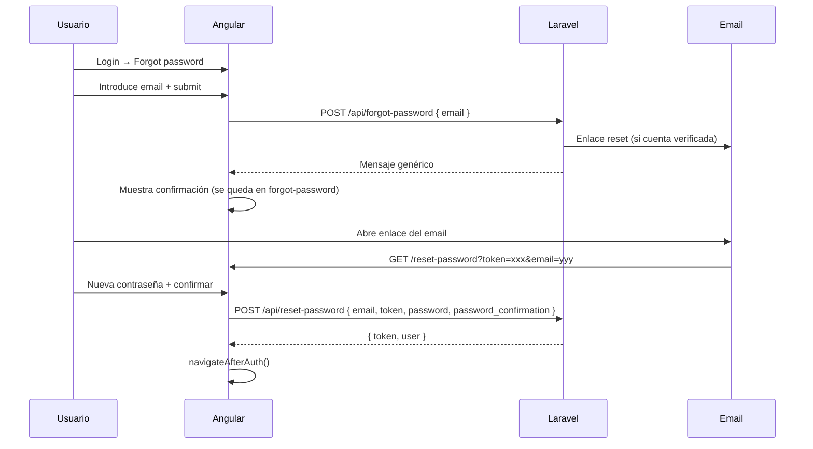

# Plan: recuperación de contraseña por enlace

**Estado:** revisado — enfoque enlace mágico (sin código de 6 dígitos).

## Objetivo

Permitir recuperar la contraseña mediante un enlace enviado por email. El usuario introduce su email, recibe un enlace con token en la URL y, al pulsarlo, solo debe escribir la nueva contraseña.

## Flujo acordado (resumen)

```
Login ──► "Forgot password?" ──► Pantalla: EMAIL + "Enviar enlace"
                                      │
                    ┌─────────────────┴─────────────────┐
                    │  Email con enlace de reset         │
                    │  (token en la URL)                 │
                    └─────────────────┬─────────────────┘
                                      ▼
              Usuario pulsa enlace del email
                                      ▼
              /reset-password?token=...&email=...
              Pantalla: SOLO NUEVA CONTRASEÑA + CONFIRMAR
                                      ▼
                         Contraseña cambiada + login automático
```

## Decisiones confirmadas

- **Enlace en el email**, no código de 6 dígitos.
- Pantalla de reset: **solo** nueva contraseña y confirmación (token y email vienen ocultos de la URL).
- Tras pedir el email: mensaje genérico en pantalla; **no** redirigir a reset (el usuario entra por el enlace del correo).
- Un solo enlace en login: *Forgot password?*
- Tras reset correcto: login automático (`navigateAfterAuth()`).
- **Validez del enlace:** 60 minutos (default Laravel en [`config/auth.php`](../euro-api/config/auth.php) → `passwords.users.expire`).

---

## Reentrada: cerrar navegador y volver

El **punto de entrada a la pantalla de reset es el enlace del email**. No hace falta un segundo enlace en login.

| Situación | Qué hace el usuario |
|-----------|---------------------|
| Cerró el navegador antes de resetear (< 60 min) | Vuelve a abrir el **mismo enlace** del email |
| Enlace caducado | Login → Forgot password → pide otro email |
| Perdió el email | Login → Forgot password → pide otro enlace |

Pantalla forgot-password tras enviar: mensaje tipo *"If an account exists, we sent a reset link to your email."* + enlace *Back to login*. **Sin** redirección automática a reset.

---

## Flujo técnico



### Paso a paso en pantalla

| Paso | Pantalla | Campos / acción |
|------|----------|-----------------|
| 1 | **Login** | *Forgot password?* → `/forgot-password` |
| 2 | **Forgot password** | Email + *Send reset link* → mensaje de confirmación |
| 3 | **Email** | Usuario pulsa enlace → abre app en `/reset-password?token=...&email=...` |
| 4 | **Reset password** | Solo password + password_confirmation (token/email leídos de la URL) |
| 5 | **Éxito** | Login automático |

Si falta `token` o `email` en la URL → pantalla reset muestra error y enlace a forgot-password.

---

## Backend (Laravel)

### Reutilizar infraestructura existente

- Tabla **`password_reset_tokens`** ya creada en [`0001_01_01_000000_create_users_table.php`](../euro-api/database/migrations/0001_01_01_000000_create_users_table.php).
- Broker Laravel en [`config/auth.php`](../euro-api/config/auth.php) (`expire: 60`, `throttle: 60`).
- **No** crear tabla `password_reset_codes` ni servicio de códigos de 6 dígitos.

### 1. Servicio: `PasswordResetService` (1 clase)

Responsabilidades:

- `sendResetLink(string $email): void` — busca usuario verificado; genera token con `Password::broker('users')`; envía mail.
- `resetPassword(string $email, string $token, string $password): User` — valida token con broker; actualiza password; revoca tokens Sanctum; devuelve usuario.

URL del enlace (construida en el Mailable):

```
{FRONTEND_URL}/reset-password?token={token}&email={urlencoded_email}
```

Ejemplo producción: `https://ecbquiz.sjbdixital.net/reset-password?token=...&email=...`

### 2. Email

- Mailable `PasswordResetLinkMail` + vista blade con botón/enlace clickable.
- Asunto tipo *"Reset your password"*.

### 3. Config

- Añadir `frontend_url` en [`config/app.php`](../euro-api/config/app.php) leyendo `FRONTEND_URL`.
- Documentar en [`.env.example`](../euro-api/.env.example) y [`.env.production`](../euro-api/.env.production):
  - Local: `FRONTEND_URL=http://localhost:4700`
  - Producción: `FRONTEND_URL=https://ecbquiz.sjbdixital.net`

### 4. Endpoints en [`AuthController`](../euro-api/app/Http/Controllers/Api/AuthController.php)

| Método | Ruta | Throttle | Body | Respuesta |
|--------|------|----------|------|-----------|
| POST | `/api/forgot-password` | `5,1` | `{ email }` | Mensaje genérico siempre |
| POST | `/api/reset-password` | `5,1` | `{ email, token, password, password_confirmation }` | `{ token, user }` |

**No** incluir endpoint de reenvío separado: el usuario repite forgot-password.

Reglas:

- Solo enviar enlace si usuario existe **y** `email_verified_at` no es null.
- Respuesta genérica en forgot (no filtrar emails).
- Tras reset: `$user->tokens()->delete()` + nuevo token Sanctum.

Registrar en [`routes/api.php`](../euro-api/routes/api.php).

---

## Frontend (Angular)

### 1. Rutas [`app.routes.ts`](../frontend/src/app/app.routes.ts)

- `/forgot-password` → `ForgotPasswordComponent` (`guestGuard`)
- `/reset-password` → `ResetPasswordComponent` (`guestGuard`)

La regla SPA existente en [`DEPLOY.md`](../DEPLOY.md) ya sirve `/reset-password` vía `index.html`.

### 2. Componentes (estilos `.auth` globales)

**`forgot-password`**

- Campo email + submit.
- Tras OK: mensaje informativo (no navegar a reset).
- Enlace *Back to login*.

**`reset-password`**

- `ngOnInit`: lee `token` y `email` de `ActivatedRoute` query params.
- Si faltan → error visible + enlace a forgot-password.
- Formulario: **solo** `password` + `password_confirmation`.
- Submit → `AuthService.resetPassword(...)`.

### 3. AuthService [`auth.service.ts`](../frontend/src/app/core/services/auth.service.ts)

- `requestPasswordReset(email)` → POST forgot-password.
- `resetPassword(email, token, password, passwordConfirmation)` → POST reset-password → guarda token + `fetchMe()`.

### 4. Login [`login.html`](../frontend/src/app/features/auth/login/login.html)

Un enlace: *Forgot password?* → `/forgot-password`.

---

## Producción / email

- Local (`MAIL_MAILER=log`): el enlace completo aparece en `storage/logs/laravel.log`.
- Producción: configurar `MAIL_*` + `FRONTEND_URL` con dominio real (sin `/backend`).

---

## Alcance acotado (KISS)

**No incluir:**

- Códigos de 6 dígitos.
- Pantalla “cambiar contraseña” estando logueado.
- Tests automatizados.

**Archivos nuevos estimados:** ~6 (1 servicio, 1 mailable, 1 blade, 2 componentes Angular, ajustes controller/routes/config/login).

---

## Tareas de implementación

- [x] `PasswordResetService` con broker Laravel + Mailable con enlace `FRONTEND_URL` + endpoints forgot/reset en `AuthController`
- [x] Pantallas forgot-password (solo email) y reset-password (solo contraseña) + ruta + enlace en login
- [x] Métodos `requestPasswordReset` y `resetPassword` en `AuthService` (token/email desde query params)
- [x] `FRONTEND_URL` en `config/app.php` y `.env.example` / `.env.production`
- [x] Nota en `DEPLOY.md` sobre `MAIL_*` y `FRONTEND_URL` en producción

---

## Verificación manual

1. Forgot → leer enlace en log → abrir URL → solo contraseñas → login automático.
2. Email inexistente → misma respuesta genérica.
3. Token inválido/caducado → 422 claro → volver a forgot-password.
4. Cerrar navegador y reabrir enlace del email (< 60 min) → reset funciona.
5. Tras reset, sesiones Sanctum anteriores invalidadas.
