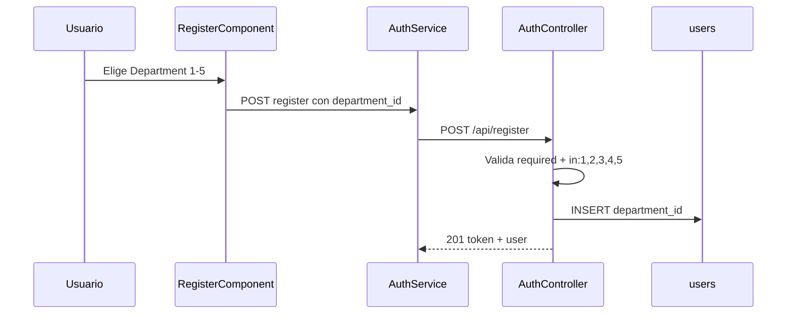

# Plan: Select de Department en registro

## Objetivo

Añadir un select de departamento (1–5) debajo del Username en el registro, persistir `department_id` en `users` y validarlo en API como campo obligatorio.

## Contexto

El registro actual solo captura `username`, `email`, `password` y `accept_terms`:

- Frontend: [`frontend/src/app/features/auth/register/register.html`](../frontend/src/app/features/auth/register/register.html), [`register.ts`](../frontend/src/app/features/auth/register/register.ts)
- API: [`euro-api/app/Http/Controllers/Api/AuthController.php`](../euro-api/app/Http/Controllers/Api/AuthController.php) — método `register()`
- Modelo: [`euro-api/app/Models/User.php`](../euro-api/app/Models/User.php) — sin `department_id`
- Tabla `users`: [`euro-api/database/migrations/0001_01_01_000000_create_users_table.php`](../euro-api/database/migrations/0001_01_01_000000_create_users_table.php)

No existe ningún campo ni tabla de departamentos. Enfoque KISS: columna en `users` + opciones hardcodeadas en frontend (sin tabla `departments` por ahora).

## Flujo objetivo



## Tareas

- [x] Crear migración `add_department_id_to_users_table` y ejecutar `migrate`
- [x] Actualizar `User.php`, `AuthController` (validación, create, formatUser) y `UserSeeder`
- [x] Añadir select en `register.html`/`register.ts` y enviar `department_id` en submit
- [x] Actualizar `AuthService`, interfaz `User` y estilos del select en `styles.scss`
- [ ] Probar registro con y sin departamento; verificar persistencia en BD

## Cambios por capa

### 1. Base de datos (Laravel)

Crear migración nueva, siguiendo el patrón de [`2026_05_31_120000_add_best_score_to_users_table.php`](../euro-api/database/migrations/2026_05_31_120000_add_best_score_to_users_table.php):

```php
$table->unsignedTinyInteger('department_id')->nullable()->after('username');
```

- `nullable()` en la columna para no romper el `ALTER TABLE` con usuarios existentes.
- Backfill: usuarios previos reciben `department_id = 1` por defecto (migración `backfill_department_id_on_users_table`).
- La obligatoriedad se fuerza solo en el endpoint de registro (nuevos usuarios).
- Ejecutar: `php artisan migrate` en `euro-api`.

### 2. Backend

**[`euro-api/app/Models/User.php`](../euro-api/app/Models/User.php)**

- Añadir `department_id` al atributo `#[Fillable([...])]`.

**[`euro-api/app/Http/Controllers/Api/AuthController.php`](../euro-api/app/Http/Controllers/Api/AuthController.php)**

- Validación en `register()`:

  ```php
  'department_id' => 'required|integer|in:1,2,3,4,5',
  ```

- Incluir en `User::create([...])`:

  ```php
  'department_id' => $data['department_id'],
  ```

- Incluir `department_id` en `formatUser()` para que `/me` y la respuesta de registro lo devuelvan.

**[`euro-api/database/seeders/UserSeeder.php`](../euro-api/database/seeders/UserSeeder.php)** (opcional pero recomendado)

- Asignar `department_id => 1` a los usuarios de prueba para coherencia.

### 3. Frontend

**[`frontend/src/app/features/auth/register/register.html`](../frontend/src/app/features/auth/register/register.html)**

- Insertar `<select>` justo debajo del input de Username (antes de Email).
- Opción placeholder deshabilitada: "Department".
- 5 opciones: Department 1 … Department 5.
- Atributo `required`.

**[`frontend/src/app/features/auth/register/register.ts`](../frontend/src/app/features/auth/register/register.ts)**

- Propiedad `departmentId: number | '' = ''`.
- Array estático `departments` con `{ id, name }`.
- En `submit()`, enviar `department_id: Number(this.departmentId)`.

**[`frontend/src/app/core/services/auth.service.ts`](../frontend/src/app/core/services/auth.service.ts)**

- Ampliar el tipo del parámetro de `register()` con `department_id: number`.

**[`frontend/src/app/core/models/game.models.ts`](../frontend/src/app/core/models/game.models.ts)**

- Añadir `department_id?: number` a la interfaz `User`.

**[`frontend/src/styles.scss`](../frontend/src/styles.scss)**

- Añadir estilos para `select` dentro de `.auth__form`, reutilizando el look de los inputs existentes (padding, border-radius, font-size, color).

No hace falta tocar [`register.scss`](../frontend/src/app/features/auth/register/register.scss) (está vacío; los estilos de auth viven en `styles.scss` global).

## Validación manual

1. Ejecutar migración en `euro-api`.
2. Abrir `/register` en el frontend.
3. Verificar que el select aparece debajo de Username.
4. Intentar registrar sin departamento → el navegador bloquea el submit (`required`).
5. Registrar con Department 3 → comprobar en BD que `users.department_id = 3`.
6. Intentar POST manual con `department_id: 99` → error 422 de validación.

## Evolución futura (fuera de este plan)

Cuando tengáis los nombres definitivos:

- Crear tabla `departments` + seeder.
- Opcional: endpoint `GET /departments` y cargar el select dinámicamente.
- La columna `department_id` en `users` seguiría siendo válida como FK.
