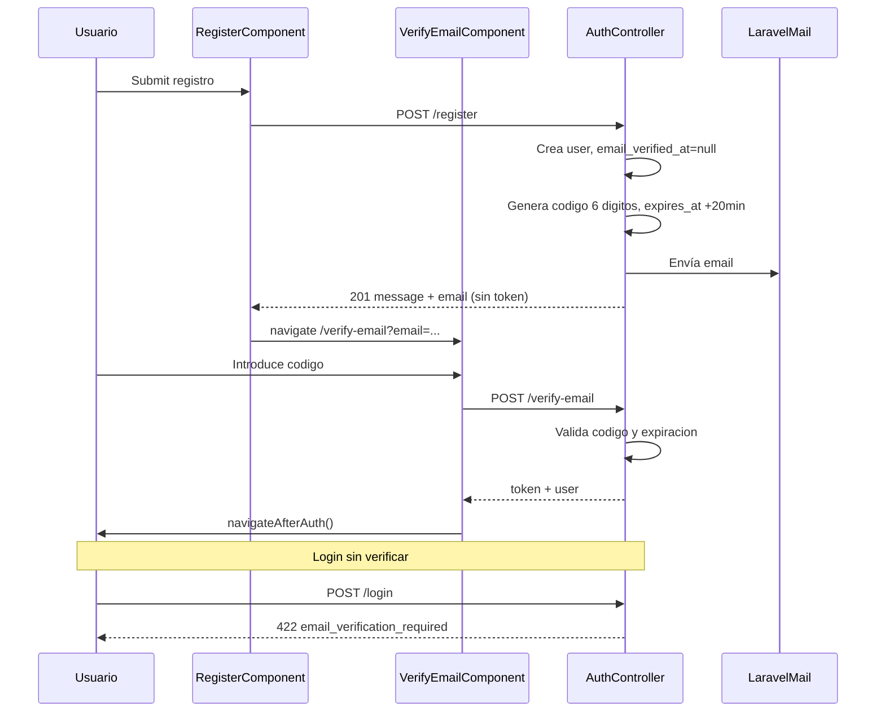

# Plan: Verificación de email en registro

## Objetivo

Añadir verificación de email en el registro con código de 6 dígitos (caducidad 20 min), bloqueo de acceso hasta verificar, pantalla de verificación en frontend, envío de email vía Laravel Mail y restricción opcional de dominio con `USERS_DOMAIN`.

## Requisitos acordados

- Código numérico de **6 dígitos**
- Caducidad: **20 minutos**
- **Bloqueo total** hasta verificar: registro sin token, login rechazado si `email_verified_at` es null
- Reenvío de código previsto (con throttle anti-abuso)
- **Restricción opcional de dominio de email** vía `USERS_DOMAIN` en `.env` (si vacío, se ignora)

## Contexto

Hoy [`AuthController::register()`](../euro-api/app/Http/Controllers/Api/AuthController.php) crea el usuario y devuelve token inmediatamente. No hay verificación ni infraestructura de email (solo [`config/mail.php`](../euro-api/config/mail.php); en local `MAIL_MAILER=log`).

Frontend: [`register.ts`](../frontend/src/app/features/auth/register/register.ts) llama a `navigateAfterAuth()` tras registro. Rutas protegidas con [`authGuard`](../frontend/src/app/core/guards/auth.guard.ts) basado en token + `/me`.

## Flujo objetivo



## Tareas

- [x] Migraciones `email_verified_at` en users + tabla `email_verification_codes` con backfill
- [x] `EmailVerificationService`, Mailable, AuthController (register/verify/resend/login), rutas API y validación `USERS_DOMAIN`
- [x] Pantalla `verify-email`, rutas, AuthService y redirecciones desde register/login
- [x] UserSeeder con `email_verified_at`
- [ ] Probar flujo completo con `MAIL_MAILER=log` y usuarios existentes/backfill

## 1. Base de datos

### Migración A: `email_verified_at` en `users`

```php
$table->timestamp('email_verified_at')->nullable()->after('email');
```

Backfill: usuarios existentes reciben `email_verified_at = registered_at` (ya registrados antes de esta feature).

### Migración B: tabla `email_verification_codes`

| Columna | Tipo | Notas |
|---------|------|-------|
| `id` | bigint PK | |
| `user_id` | FK users, unique | un código activo por usuario |
| `code_hash` | string | Hash del código (no guardar en claro) |
| `expires_at` | datetime | now + 20 min |
| `timestamps` | | |

Al reenviar: `updateOrCreate` por `user_id` con nuevo hash y nueva expiración.

## 2. Backend (Laravel)

### Modelo y servicio (un solo servicio nuevo, KISS)

**[`euro-api/app/Services/EmailVerificationService.php`](../euro-api/app/Services/EmailVerificationService.php)** — métodos:

- `issueCode(User $user): void` — genera 6 dígitos (`random_int(100000, 999999)`), guarda hash, envía mail
- `verify(User $user, string $code): bool` — comprueba expiración + `Hash::check`
- `markVerified(User $user): void` — `email_verified_at = now()`, borra fila de código

**[`euro-api/app/Mail/EmailVerificationCodeMail.php`](../euro-api/app/Mail/EmailVerificationCodeMail.php)** + vista Blade mínima en `resources/views/mail/email-verification-code.blade.php` con el código y texto de caducidad 20 min.

**[`euro-api/app/Models/User.php`](../euro-api/app/Models/User.php)**

- Añadir `email_verified_at` a `Fillable` y `casts` (datetime)
- Método helper `isEmailVerified(): bool`

### AuthController — cambios en [`AuthController.php`](../euro-api/app/Http/Controllers/Api/AuthController.php)

**`register()`**

- Validar email con regla de dominio opcional (ver sección **Restricción de dominio**)
- Tras `User::create`, llamar `EmailVerificationService::issueCode($user)`
- Respuesta **201 sin token**:

  ```json
  { "message": "...", "email": "user@ecb.europa.eu", "email_verification_required": true }
  ```

**`verifyEmail()`** (nuevo)

- Validar: `email`, `code` (string, size:6, regex dígitos)
- Buscar usuario por email; si ya verificado → error; si no existe → error genérico
- Si código válido: `markVerified`, emitir token Sanctum, devolver `{ token, user }` (como login)

**`resendVerificationCode()`** (nuevo)

- Validar: `email`
- Solo si usuario existe y `!isEmailVerified()`
- Throttle: middleware `throttle:3,1` (3 req/min por IP)
- Llamar `issueCode()` de nuevo

**`login()`**

- Tras credenciales válidas, si `!$user->isEmailVerified()`:

  ```json
  HTTP 422
  { "message": "...", "email_verification_required": true, "email": "..." }
  ```

- No emitir token

**`formatUser()`** — incluir `email_verified_at` (opcional, útil para debug).

### Rutas en [`api.php`](../euro-api/routes/api.php)

```php
Route::post('/verify-email', [AuthController::class, 'verifyEmail']);
Route::post('/resend-verification-code', [AuthController::class, 'resendVerificationCode'])
    ->middleware('throttle:3,1');
```

### UserSeeder

Asignar `email_verified_at => now()` a usuarios de prueba para no bloquear desarrollo local.

### Restricción de dominio (`USERS_DOMAIN`)

Variable de entorno opcional para limitar el registro a emails de un dominio concreto.

**Configuración**

En `euro-api/.env` / `.env.example`:

```env
# Vacío = sin restricción. Ejemplo producción ECB:
USERS_DOMAIN=ecb.europa.eu
```

Exponer en [`euro-api/config/app.php`](../euro-api/config/app.php):

```php
'users_domain' => env('USERS_DOMAIN', ''),
```

**Comportamiento**

| `USERS_DOMAIN` | Efecto |
|----------------|--------|
| vacío / no definido | Cualquier email válido pasa |
| `ecb.europa.eu` | Solo emails cuyo dominio sea exactamente `ecb.europa.eu` |

**Validación en `register()`**

Tras la validación estándar de `email`, si `config('app.users_domain')` no está vacío:

- Comprobar que la parte tras `@` del email coincide (case-insensitive) con el dominio configurado.
- Mensaje claro: *"The email must belong to the allowed domain."*

**Notas**

- Solo aplica en **registro** (login no revalida dominio; usuarios ya creados no se ven afectados).
- En local dejar `USERS_DOMAIN=` vacío para usar emails `@elp.local` del seeder.
- No requiere cambios en frontend (el API devuelve 422 y el formulario muestra el error).

## 3. Frontend (Angular)

### Nueva pantalla `verify-email`

Carpeta: `frontend/src/app/features/auth/verify-email/` (html, ts, scss vacío como el resto de auth).

- Input numérico 6 dígitos (maxlength=6, pattern)
- Botón "Verify"
- Botón "Resend code" con cooldown visual ~60 s
- Muestra email destino (desde query param `?email=`)
- Mensajes de error (código incorrecto, expirado)

### Rutas en [`app.routes.ts`](../frontend/src/app/app.routes.ts)

```typescript
{ path: 'verify-email', component: VerifyEmailComponent, canActivate: [guestGuard] }
```

### AuthService — [`auth.service.ts`](../frontend/src/app/core/services/auth.service.ts)

- **`register()`**: ya no espera token; devuelve `{ email, message }`. Sin `storeAuthToken`.
- **`verifyEmail(email, code)`**: POST `/verify-email`, guarda token, `fetchMe()`, `navigateAfterAuth()`.
- **`resendVerificationCode(email)`**: POST `/resend-verification-code`.
- **`login()`**: si respuesta incluye `email_verification_required`, propagar para que login redirija a `/verify-email?email=...`.

### Cambios en componentes existentes

**[`register.ts`](../frontend/src/app/features/auth/register/register.ts)**

- Tras registro OK → `router.navigate(['/verify-email'], { queryParams: { email } })` (no `navigateAfterAuth`).

**[`login.ts`](../frontend/src/app/features/auth/login/login.ts)**

- Si error con `email_verification_required` → redirigir a verify-email con el email.

### Modelo User — [`game.models.ts`](../frontend/src/app/core/models/game.models.ts)

- Añadir `email_verified_at?: string | null` si se expone en API.

### Estilos

Reutilizar clases `.auth` de [`styles.scss`](../frontend/src/styles.scss); input de código con mismo estilo que inputs de login/register.

## 4. Email / entorno

- **Local**: mantener `MAIL_MAILER=log` — el código aparece en `storage/logs/laravel.log`.
- **Local**: `USERS_DOMAIN=` vacío para permitir emails de prueba (`@elp.local`).
- **Producción**: configurar SMTP real en `.env.production` (`MAIL_MAILER`, `MAIL_HOST`, credenciales, `MAIL_FROM_ADDRESS`).
- **Producción**: `USERS_DOMAIN=ecb.europa.eu` (o el dominio acordado).

No bloquear la implementación por SMTP: con `log` se puede probar el flujo completo en local.

## 5. Seguridad

- Código almacenado hasheado (como password)
- Respuestas genéricas en verify/resend para no revelar si un email existe (excepto login/register que ya validan unique)
- Throttle en resend y verify (p. ej. 5 intentos/min en verify)
- Invalidar código tras verificación exitosa (delete row)

## 6. Validación manual

1. Registrar usuario nuevo → redirige a `/verify-email`, sin token en localStorage.
2. Copiar código del log → verificar → entra en app con token.
3. Intentar login sin verificar → mensaje + redirección a verify.
4. Código expirado (>20 min) → error claro; reenviar → nuevo código funciona.
5. Usuarios existentes (backfill) → login normal sin verify.
6. UserSeeder local → login directo.
7. Con `USERS_DOMAIN=ecb.europa.eu` → registro con `user@gmail.com` rechazado (422).
8. Con `USERS_DOMAIN=` vacío → cualquier dominio válido permitido.

## Archivos principales a crear/modificar

| Acción | Archivo |
|--------|---------|
| Crear | `euro-api/database/migrations/*_add_email_verified_at_to_users_table.php` |
| Crear | `euro-api/database/migrations/*_create_email_verification_codes_table.php` |
| Crear | `euro-api/app/Services/EmailVerificationService.php` |
| Crear | `euro-api/app/Mail/EmailVerificationCodeMail.php` |
| Crear | `euro-api/resources/views/mail/email-verification-code.blade.php` |
| Modificar | `euro-api/config/app.php` |
| Modificar | `euro-api/.env.example` (añadir `USERS_DOMAIN=`) |
| Modificar | `euro-api/app/Http/Controllers/Api/AuthController.php` |
| Modificar | `euro-api/app/Models/User.php` |
| Modificar | `euro-api/routes/api.php` |
| Modificar | `euro-api/database/seeders/UserSeeder.php` |
| Crear | `frontend/src/app/features/auth/verify-email/*` |
| Modificar | `frontend/src/app/app.routes.ts` |
| Modificar | `frontend/src/app/core/services/auth.service.ts` |
| Modificar | `frontend/src/app/features/auth/register/register.ts` |
| Modificar | `frontend/src/app/features/auth/login/login.ts` |

## Fuera de alcance (fase posterior)

- Tabla/plantillas de email branded ECB
- Tests automatizados PHPUnit/Jasmine
